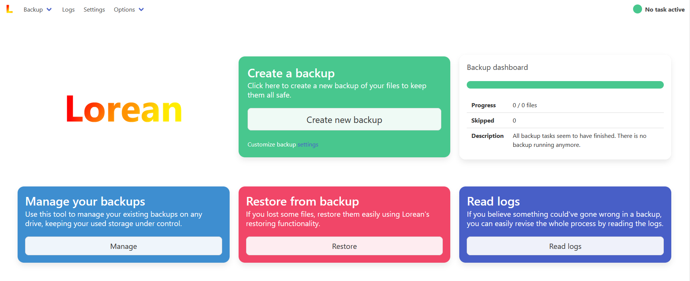
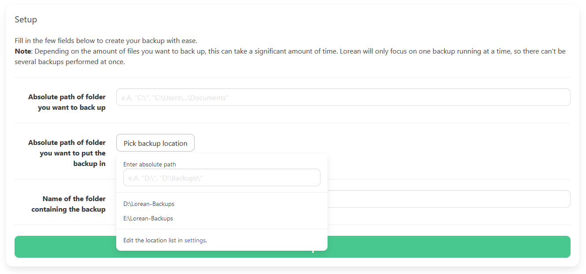
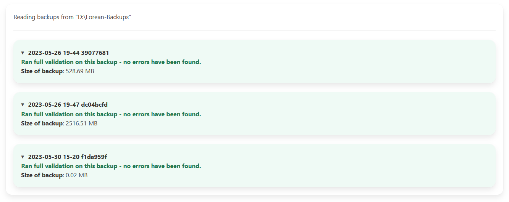

# Backups simplified.

Lorean is a straightforward way to create backups of your valuable personal data, protecting you against malware, data loss and drive malfunctions. It comes with an amazing UI and full control over the backup process, writes logs, can exclude patterns from your backup data to save storage and validate the usability of your backups.

---

# [**Install**](./getting_started.md) / [Documentation](./documentation.md) / [GitHub](https://github.com/mags0ft/Lorean)

## 🔥 Features

- ### 🚫 Regex-powered excludes

- ### 🔎 Backup scanning

- ### 📕 Detailed logging

- ### 🥳 Keeps your backups organized

- ### ✨ Beautiful UI

---

## Getting started
To do your first steps with Lorean, read the brief article on how to set it up [here](./getting_started.md)!

---

## Screenshots

The main dashbord of Lorean.

Creating a new backup using Lorean.

Management screen to supervise all your backups.