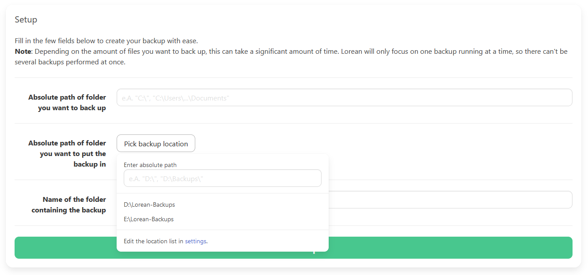

# Creating a Lorean backup

Using the simple UI of Lorean, it shouldn't be hard to create your first backup at all; just follow the instructions below. If you didn't read [the first step guide](./first_steps.md) before, please do so before moving on with this article.

## Instructions

Open Lorean in your browser and click on the "Create backup" button. You should see a screen similar to this:

1. First of all, you need to specify **which** folder on your PC you want to back up. You do so by pasting the **absolute** path into the first input field. *If you don't know the absolute path, just open your file explorer, pick the folder and copy the path by right-clicking the directory or copying it's path from the address bar.*

2. Next up, you select which drive and folder to copy your backup to. Just hover over the button, select your drive from the list **or** enter another **absolute** path into the input field. Make sure ypur backup drive is plugged into your PC.

3. In the last field, you can decide how to call the backup, but this is entirely optional. It's recommended to **keep the value like it is** as it makes it possible for Lorean to sort your backups by date.

4. Hit the green "Run backup" button. The backup monitor will open and show you the progress. If an error occurs, it's reported and can also be read in the logs afterwards.

5. Please validate that the backup has been created correctly and remove your drive once you're done.