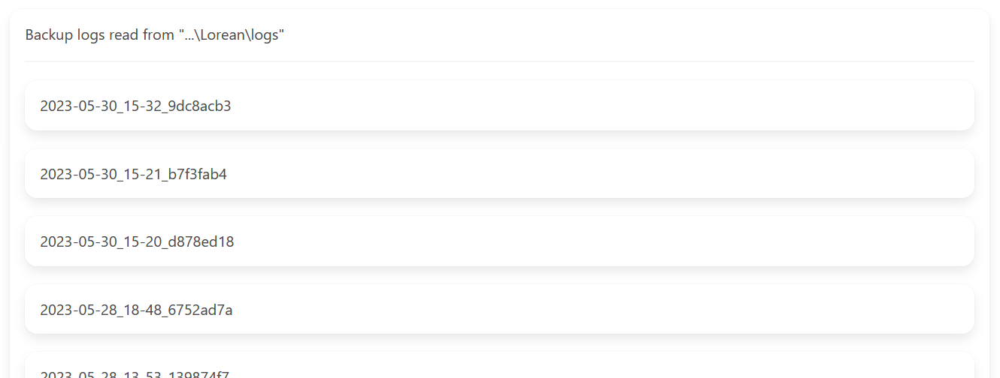

# Logs in Lorean

## Instructions

1. Navigate to the log view using the navigation bar or home page.
2. You should see something like this if you already ran some backups:

Pick the log file you want to read.

3. The log file reader will open up and you can now examine what happened in the last backup process.