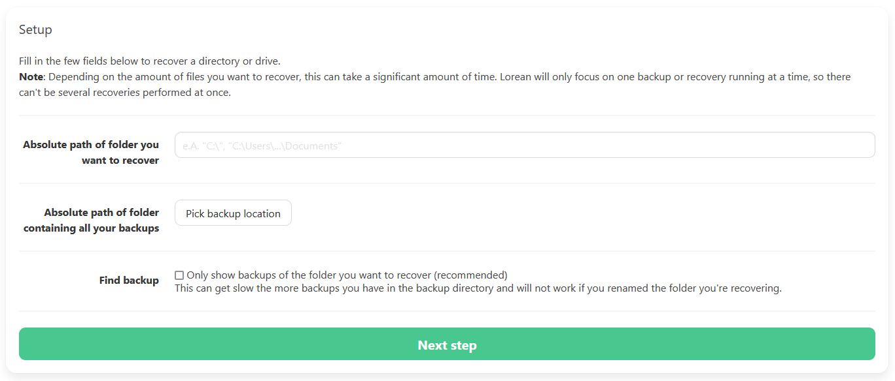
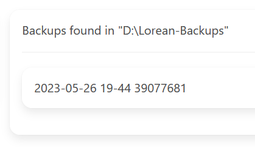
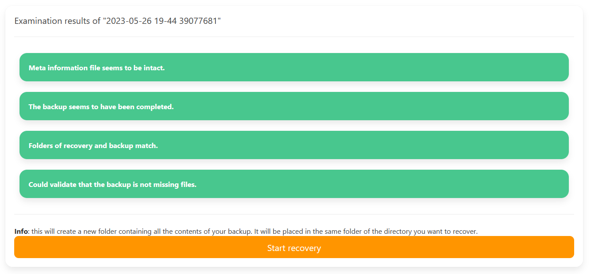

# Restore from a backup

If you lost some data due to corruption, ransomware, malicious software or just by accident, you can easily restore from your last backup using Lorean. Follow the instructions below to understand how to do this.

## Instructions

Navigate to the restoring page, either by hovering over "Backup" in the navigation bar and clicking "Restore" or by going back to the home page and selecting "Restore".

You should see an interface like this:

1. Enter the **full, absolute path** of the folder you messed up in.
2. Mount and select your backup drive, or enter an absolute path to the folder containing your backups.
3. **Tick** the checkbox to make Lorean automatically find the correct backup as this makes it less likely you mess the recovery up. If no backups are found in the next step, go back, remove the tick and try again.
4. Click "Next step".

5. The found backups are listed and you can select the one you wish to restore from.

6. After you selected your backup, Lorean will run some examination and validation tasks on it; wait for it to finish and read through them.

All checks should be green, like shown in the image above; if there are errors found, rather select another backup.

7. Click on "Start recovery". Wait for it to finish.

8. You should now find a folder containing all the restored data in the parent directory your damaged folder is sitting in. You can copy the new data over, just keep the new folder or save individual files using your system's file explorer.